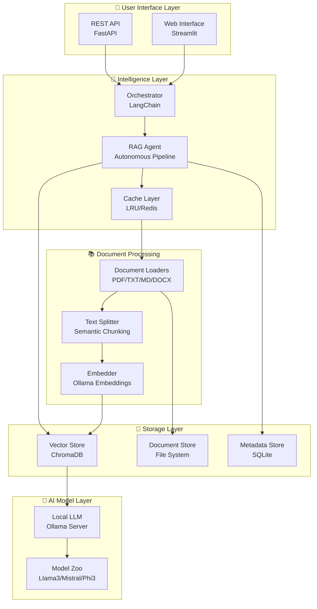
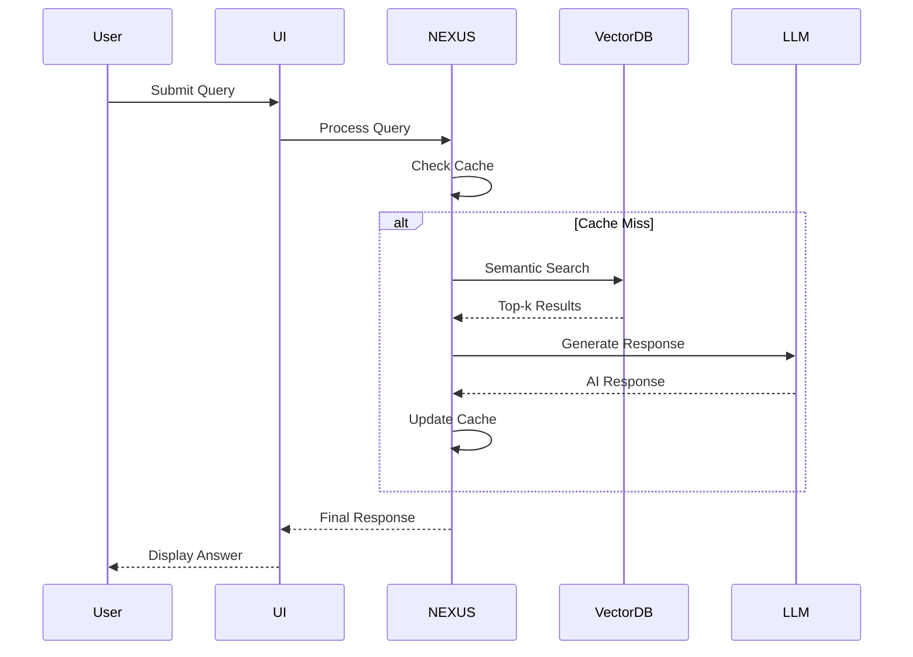
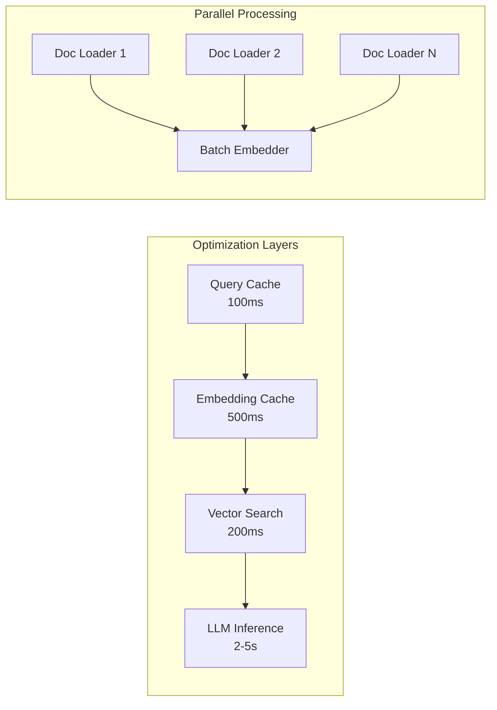
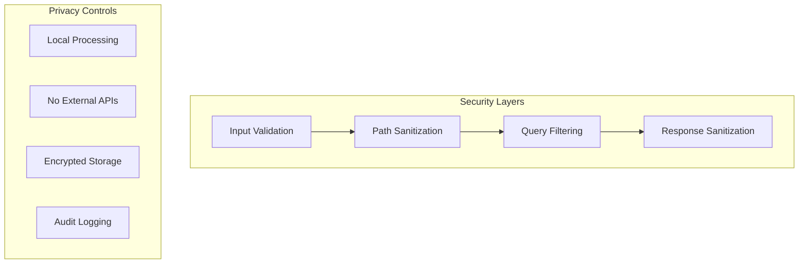
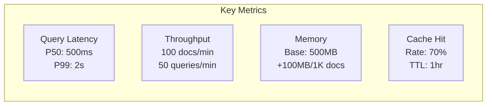
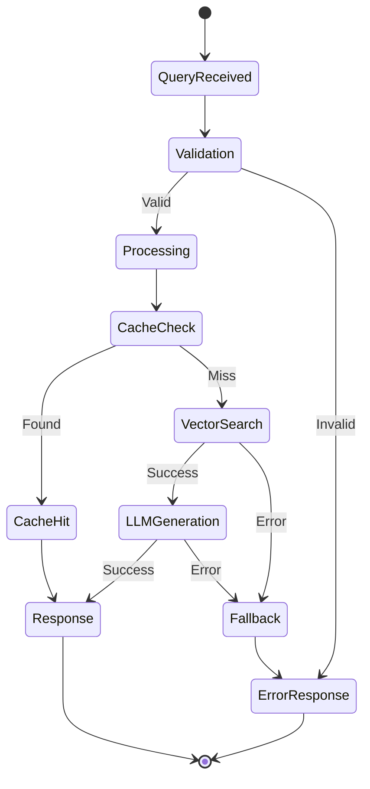

# 🏗 NEXUS Architecture Documentation

## System Architecture



## Component Details

### 🎯 User Interface Layer
- **Streamlit UI**: Interactive chat interface with real-time responses
- **REST API**: (Future) RESTful endpoints for programmatic access

### 🧠 Intelligence Layer
- **Orchestrator**: LangChain-based pipeline coordination
- **RAG Agent**: Autonomous retrieval and generation logic
- **Cache Layer**: Multi-level caching for performance

### 📚 Document Processing
- **Document Loaders**: Extensible format support
- **Text Splitter**: Intelligent chunking with overlap
- **Embedder**: Local embedding generation via Ollama

### 💾 Storage Layer
- **Vector Store**: ChromaDB with HNSW indexing
- **Document Store**: Raw document preservation
- **Metadata Store**: Query history and analytics

### 🤖 AI Model Layer
- **Ollama Server**: Local LLM inference engine
- **Model Zoo**: Support for multiple models

## Data Flow



## Performance Architecture



## Scalability Design

| Component | Current | Scalable To | Method |
|-----------|---------|-------------|--------|
| Documents | 1K | 100K+ | Incremental indexing |
| Queries/sec | 10 | 1000+ | Horizontal scaling |
| Users | 1 | 50+ | Async processing |
| Vector DB | 1GB | 100GB+ | Sharding |

## Security Architecture



## Deployment Patterns

### Standalone
```
Single Machine
├── NEXUS Application
├── Ollama Server
├── ChromaDB
└── File Storage
```

### Distributed
```
Load Balancer
├── NEXUS Node 1
├── NEXUS Node 2
└── NEXUS Node N
    ├── Shared ChromaDB
    ├── Shared Ollama Pool
    └── Distributed Cache
```

### Containerized
```yaml
version: '3.8'
services:
  nexus:
    build: .
    ports:
      - "8501:8501"
    volumes:
      - ./documents:/app/documents
      - ./chroma_db:/app/chroma_db

  ollama:
    image: ollama/ollama
    ports:
      - "11434:11434"
    volumes:
      - ollama_models:/root/.ollama
```

## Technology Stack

| Layer | Technology | Purpose |
|-------|------------|---------|
| **Frontend** | Streamlit | Web UI |
| **Backend** | Python 3.9+ | Core logic |
| **Orchestration** | LangChain | Pipeline management |
| **Vector DB** | ChromaDB | Semantic search |
| **LLM Runtime** | Ollama | Model inference |
| **Caching** | LRU/Redis | Performance |
| **Monitoring** | Prometheus | Metrics |
| **Logging** | Structured Logging | Debugging |

## Extension Points

### Adding New Document Types
```python
# loaders/custom_loader.py
class CustomLoader(BaseLoader):
    def load(self, path: str) -> List[Document]:
        # Custom loading logic
        pass
```

### Custom Embedding Models
```python
# embeddings/custom_embedder.py
class CustomEmbedder(BaseEmbeddings):
    def embed_documents(self, texts: List[str]) -> List[List[float]]:
        # Custom embedding logic
        pass
```

### Plugin System (Future)
```python
# plugins/custom_plugin.py
class CustomPlugin(NEXUSPlugin):
    def on_query(self, query: str) -> str:
        # Pre-process query
        pass

    def on_response(self, response: str) -> str:
        # Post-process response
        pass
```

## Performance Metrics



## Error Handling



---

*NEXUS Architecture v1.0 - Autonomous Document Intelligence System*